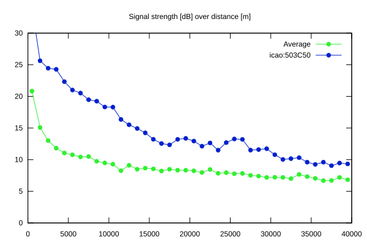
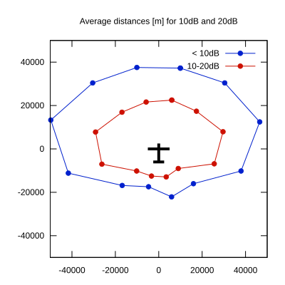

# Ktrax range report — device 503C50

- **Pilot:** Linas Miežlaiškis (18_meter, CN V)
- **Aircraft registration:** LY-EVL
- **live_track_id:** `OGNC3074C:ICA503C50`
- **Ktrax callsign/ID:** LY-EVL
- **Last measurement:** 2026-07-17T14:23:31Z
- **Versions:** Hardware: 41/Software: 7.43 (received: 2026-07-17T13:37:29Z)
- **Source:** https://ktrax.kisstech.ch/plot?device=503C50 (fetched 2026-07-19T09:14:46Z)

