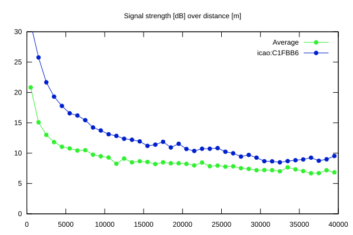
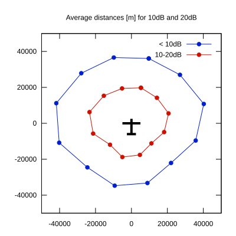

# Ktrax range report — device C1FBB6

- **Pilot:** Borgmann & Wolff (double_seater, CN DX)
- **Aircraft registration:** D-KYDX
- **live_track_id:** `OGN6CAC34:ICAC1FBB6`
- **Ktrax callsign/ID:** -
- **Last measurement:** 2026-07-12T17:28:09Z
- **Versions:** Hardware: 41/Software: 7.43 (received: 2026-07-12T16:57:42Z)
- **Source:** https://ktrax.kisstech.ch/plot?device=C1FBB6 (fetched 2026-07-19T09:14:46Z)

