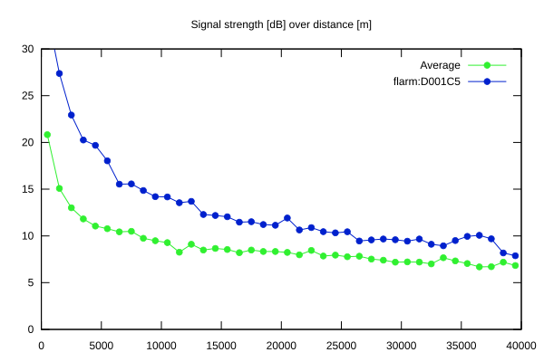
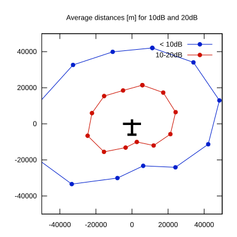

# Ktrax range report — device D001C5

- **Pilot:** Laurent Aboulin (open, CN 5)
- **Aircraft registration:** ZT-GAI
- **live_track_id:** `OGNBF9098:FLRD001C5`
- **Ktrax callsign/ID:** ZT-GAI
- **Last measurement:** 2026-07-11T10:43:28Z
- **Versions:** Hardware: 41/Software: 7.43 (received: 2026-07-11T10:38:50Z)
- **Source:** https://ktrax.kisstech.ch/plot?device=D001C5 (fetched 2026-07-19T09:14:46Z)

