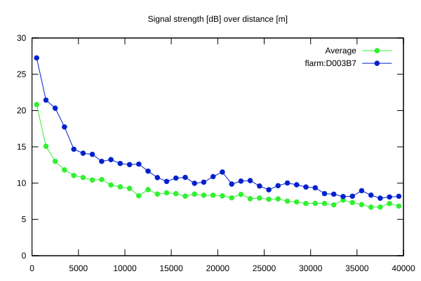
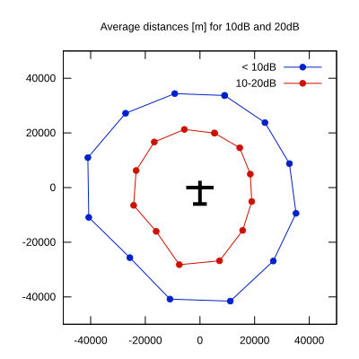

# Ktrax range report — device D003B7

- **Pilot:** Felipe Levin (open, CN FL)
- **Aircraft registration:** D-KFFL
- **live_track_id:** `OGN6C7AEC:FLRD003B7`
- **Ktrax callsign/ID:** -
- **Last measurement:** 2026-07-03T18:07:07Z
- **Versions:** Hardware: 41/Software: 7.43 (received: 2026-07-03T18:05:27Z)
- **Source:** https://ktrax.kisstech.ch/plot?device=D003B7 (fetched 2026-07-19T09:14:46Z)

