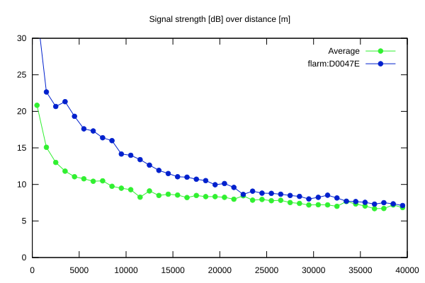
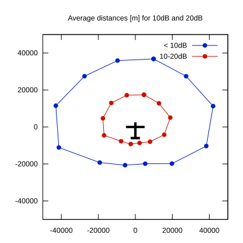

# Ktrax range report — device D0047E

- **Pilot:** Kassai & Mészáros (double_seater, CN HUX)
- **Aircraft registration:** D-KHUN
- **live_track_id:** `OGN6CAC14:FLRD0047E`
- **Ktrax callsign/ID:** D-KHUN
- **Last measurement:** 2026-07-18T16:36:25Z
- **Versions:** Hardware: 41/Software: 7.43 (received: 2026-07-18T17:25:10Z)
- **Source:** https://ktrax.kisstech.ch/plot?device=D0047E (fetched 2026-07-19T09:14:46Z)

