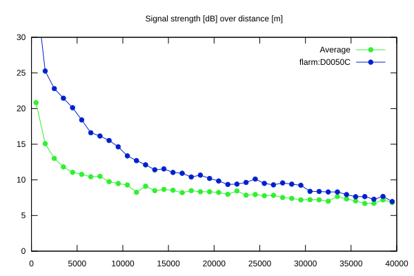
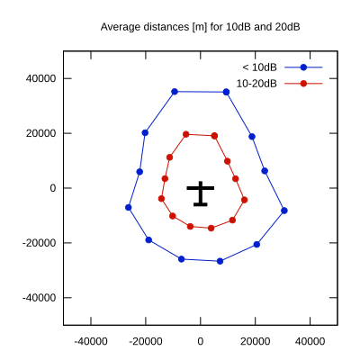

# Ktrax range report — device D0050C

- **Pilot:** Arne J. Boye-Møller (18_meter, CN AB)
- **Aircraft registration:** D-KDAB
- **live_track_id:** `OGNC307BC:FLRD0050C`
- **Ktrax callsign/ID:** D-KDAB
- **Last measurement:** 2026-07-15T16:23:38Z
- **Versions:** Hardware: 41/Software: 7.43 (received: 2026-07-15T16:18:38Z)
- **Source:** https://ktrax.kisstech.ch/plot?device=D0050C (fetched 2026-07-19T09:14:46Z)

