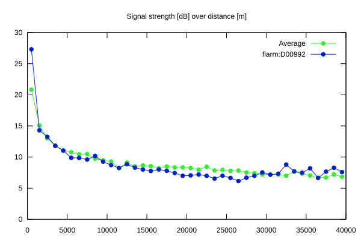
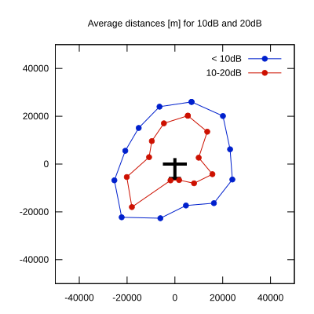

# Ktrax range report — device D00992

- **Pilot:** Vladimir Foltin (18_meter, CN 8)
- **Aircraft registration:** OM-0003
- **live_track_id:** `OGN6C7B40:FLRD00992`
- **Ktrax callsign/ID:** OM-0003
- **Last measurement:** 2026-07-18T15:58:57Z
- **Versions:** Hardware: 41/Software: 7.43 (received: 2026-07-18T16:02:28Z)
- **Source:** https://ktrax.kisstech.ch/plot?device=D00992 (fetched 2026-07-19T09:14:46Z)

