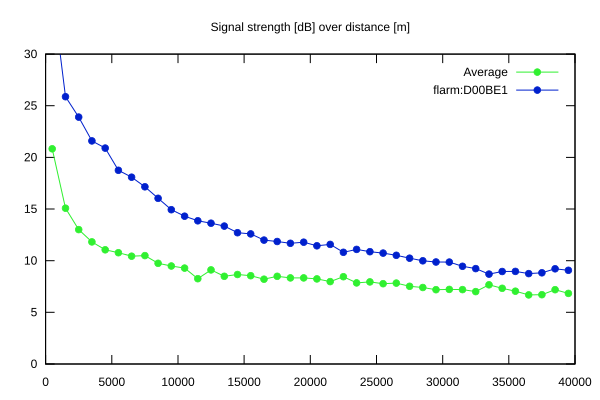
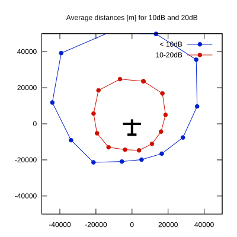

# Ktrax range report — device D00BE1

- **Pilot:** Norm Bloch (18_meter, CN BR)
- **Aircraft registration:** SE-SKR
- **live_track_id:** `OGNC30A40:FLRD00BE1`
- **Ktrax callsign/ID:** SE-SKR
- **Last measurement:** 2026-07-17T15:20:09Z
- **Versions:** Hardware: 41/Software: 7.40 (received: 2026-07-17T15:20:07Z)
- **Source:** https://ktrax.kisstech.ch/plot?device=D00BE1 (fetched 2026-07-19T09:14:46Z)

