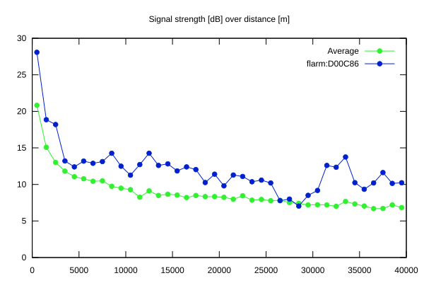
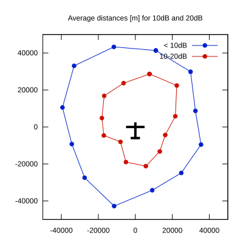

# Ktrax range report — device D00C86

- **Pilot:** Sjaak Selen (18_meter, CN MM)
- **Aircraft registration:** D-KLXM
- **live_track_id:** `OGN6C7B34:FLRD00C86`
- **Ktrax callsign/ID:** D-KLXM
- **Last measurement:** 2026-07-18T15:51:34Z
- **Versions:** Hardware: 41/Software: 7.43 (received: 2026-07-18T15:48:35Z)
- **Source:** https://ktrax.kisstech.ch/plot?device=D00C86 (fetched 2026-07-19T09:14:46Z)

