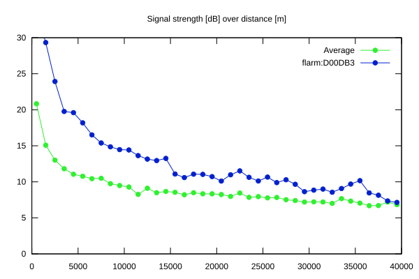
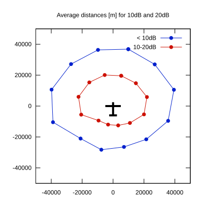

# Ktrax range report — device D00DB3

- **Pilot:** Cronjäger & Blum (double_seater, CN KA)
- **Aircraft registration:** D-KNON
- **live_track_id:** `OGNC30810:FLRD00DB3`
- **Ktrax callsign/ID:** D-KNON
- **Last measurement:** 2026-07-05T18:57:25Z
- **Versions:** Hardware: 41/Software: 7.43 (received: 2026-07-05T18:56:27Z)
- **Source:** https://ktrax.kisstech.ch/plot?device=D00DB3 (fetched 2026-07-19T09:14:46Z)

