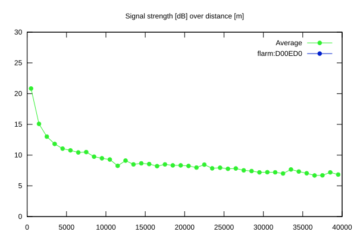
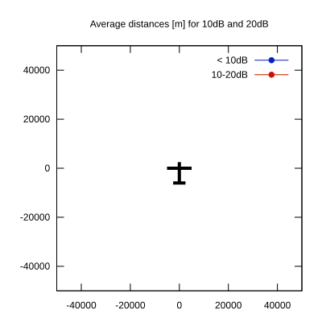

# Ktrax range report — device D00ED0

- **Pilot:** Victor Mallick (18_meter, CN FM)
- **Aircraft registration:** F-CLDG
- **live_track_id:** `OGNC3084C:FLRD00ED0`
- **Ktrax callsign/ID:** F-CLDG
- **Last measurement:** 2026-07-09T16:11:22Z
- **Versions:** Hardware: 41/Software: 7.43 (received: 2026-07-03T09:46:43Z)
- **Source:** https://ktrax.kisstech.ch/plot?device=D00ED0 (fetched 2026-07-19T09:14:46Z)

