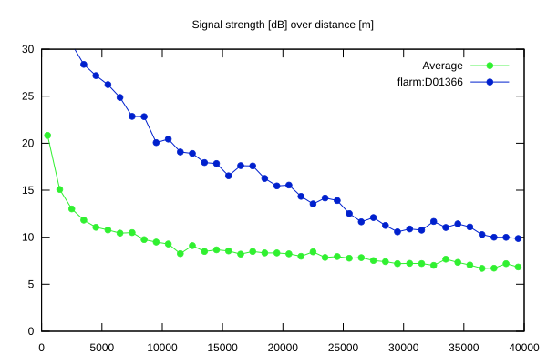
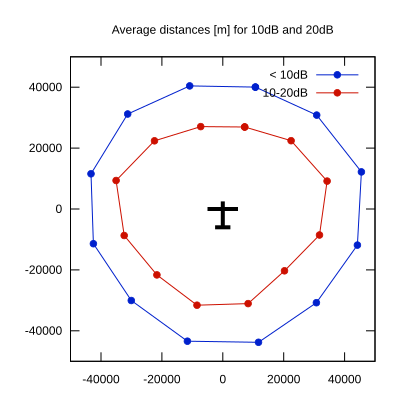

# Ktrax range report — device D01366

- **Pilot:** Petri Sucksdorff (18_meter, CN WS)
- **Aircraft registration:** OH-1033
- **live_track_id:** `OGNC30A10:FLRD01366`
- **Ktrax callsign/ID:** OH-1033
- **Last measurement:** 2026-07-16T14:27:00Z
- **Versions:** Hardware: 41/Software: 7.43 (received: 2026-07-16T14:28:25Z)
- **Source:** https://ktrax.kisstech.ch/plot?device=D01366 (fetched 2026-07-19T09:14:46Z)

