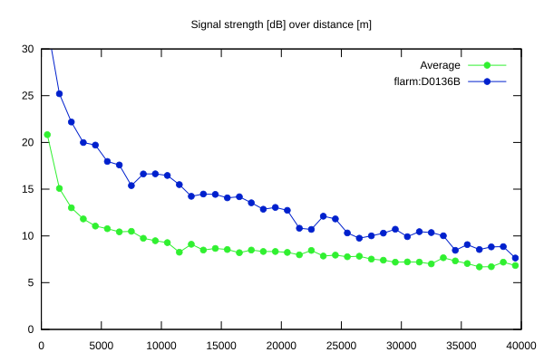
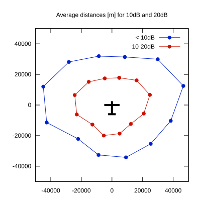

# Ktrax range report — device D0136B

- **Pilot:** Sean Fidler (18_meter, CN JL)
- **Aircraft registration:** D-KTJL
- **live_track_id:** `OGNC3094C:FLRD0136B`
- **Ktrax callsign/ID:** D-KTJL
- **Last measurement:** 2026-07-12T13:06:49Z
- **Versions:** Hardware: 41/Software: 7.43 (received: 2026-07-12T13:03:43Z)
- **Source:** https://ktrax.kisstech.ch/plot?device=D0136B (fetched 2026-07-19T09:14:46Z)

