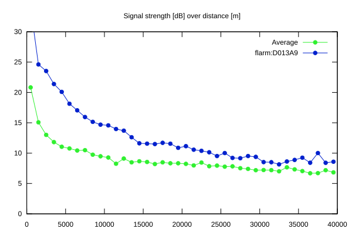
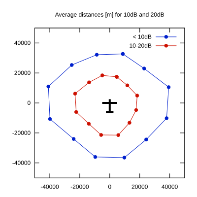

# Ktrax range report — device D013A9

- **Pilot:** Delfosse & De Broqueville (double_seater, CN 2AS)
- **Aircraft registration:** D-KASL
- **live_track_id:** `OGN6C7B60:FLRD013A9`
- **Ktrax callsign/ID:** D-KASL
- **Last measurement:** 2026-07-19T09:14:43Z
- **Versions:** Hardware: 41/Software: 7.43 (received: 2026-07-19T09:13:20Z)
- **Source:** https://ktrax.kisstech.ch/plot?device=D013A9 (fetched 2026-07-19T09:14:46Z)

