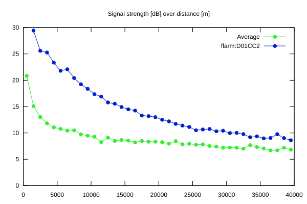
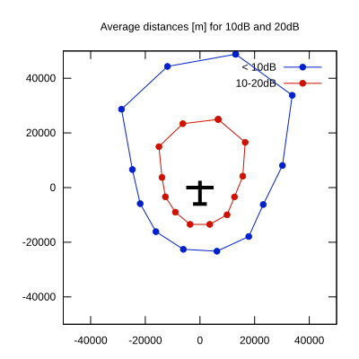

# Ktrax range report — device D01CC2

- **Pilot:** Kato Kvitne (18_meter, CN EL)
- **Aircraft registration:** LN-GEL
- **live_track_id:** `OGN6CAC80:FLRD01CC2`
- **Ktrax callsign/ID:** LN-GEL
- **Last measurement:** 2026-07-13T16:30:21Z
- **Versions:** Hardware: 41/Software: 7.43 (received: 2026-07-13T16:28:58Z)
- **Source:** https://ktrax.kisstech.ch/plot?device=D01CC2 (fetched 2026-07-19T09:14:46Z)

