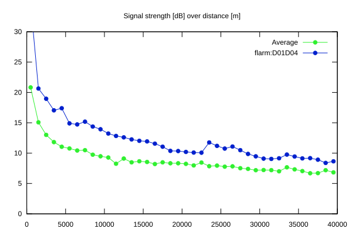
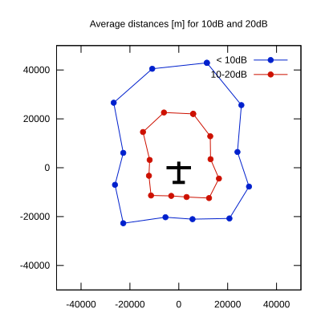

# Ktrax range report — device D01D04

- **Pilot:** Ronny Eriksson (18_meter, CN R)
- **Aircraft registration:** SE-UXR
- **live_track_id:** `OGN6CAC38:FLRD01D04`
- **Ktrax callsign/ID:** SE-UXR
- **Last measurement:** 2026-07-17T15:55:04Z
- **Versions:** Hardware: 41/Software: 7.43 (received: 2026-07-17T15:51:27Z)
- **Source:** https://ktrax.kisstech.ch/plot?device=D01D04 (fetched 2026-07-19T09:14:46Z)

