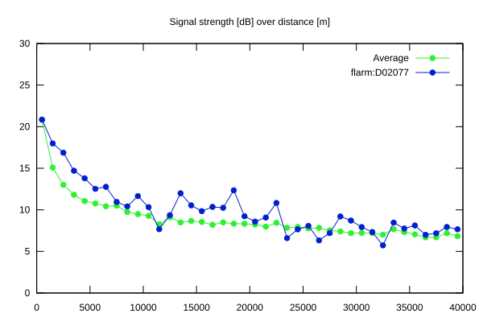
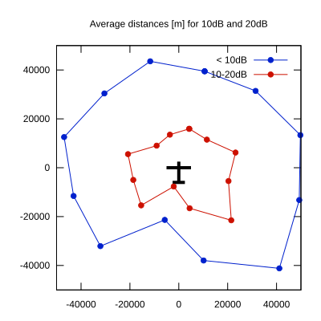

# Ktrax range report — device D02077

- **Pilot:** Lešinger & Grula (double_seater, CN DXI)
- **Aircraft registration:** OK-2033
- **live_track_id:** `OGN6CAC44:FLRD02077`
- **Ktrax callsign/ID:** OK-2033
- **Last measurement:** 2026-07-11T13:54:26Z
- **Versions:** Hardware: 41/Software: 7.43 (received: 2026-07-11T13:37:26Z)
- **Source:** https://ktrax.kisstech.ch/plot?device=D02077 (fetched 2026-07-19T09:14:46Z)

