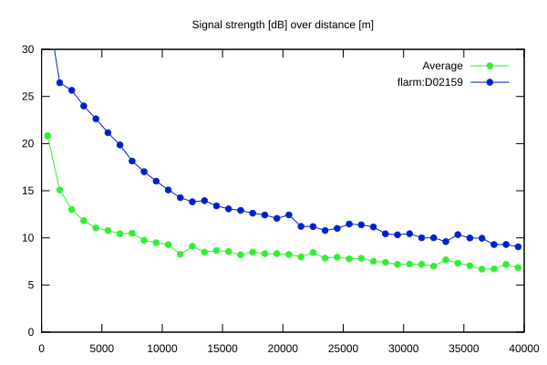
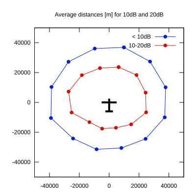

# Ktrax range report — device D02159

- **Pilot:** Kettunen & Sorri (double_seater, CN AM)
- **Aircraft registration:** OH-1018
- **live_track_id:** `OGN6CAC48:FLRD02159`
- **Ktrax callsign/ID:** OH-1018
- **Last measurement:** 2026-07-18T08:50:18Z
- **Versions:** Hardware: 41/Software: 7.43 (received: 2026-07-18T08:39:24Z)
- **Source:** https://ktrax.kisstech.ch/plot?device=D02159 (fetched 2026-07-19T09:14:46Z)

