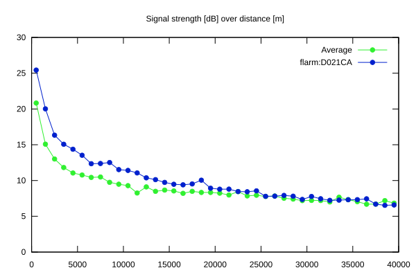
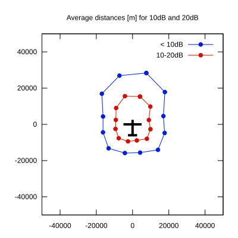

# Ktrax range report — device D021CA

- **Pilot:** Geza Toth (18_meter, CN WX)
- **Aircraft registration:** D-KMWX
- **live_track_id:** `OGNC30758:FLRD021CA`
- **Ktrax callsign/ID:** D-KMWX
- **Last measurement:** 2026-07-18T17:34:22Z
- **Versions:** Hardware: 41/Software: 7.43 (received: 2026-07-18T17:23:47Z)
- **Source:** https://ktrax.kisstech.ch/plot?device=D021CA (fetched 2026-07-19T09:14:46Z)

