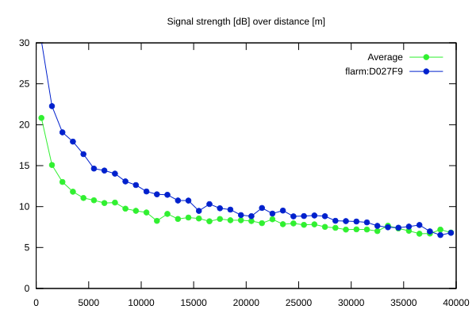
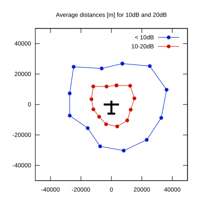

# Ktrax range report — device D027F9

- **Pilot:** Mark (Lumpy) Paterson (18_meter, CN JS3)
- **Aircraft registration:** D-KGLI
- **live_track_id:** `OGNBF82D0:FLRD027F9`
- **Ktrax callsign/ID:** D-KGLI
- **Last measurement:** 2026-07-16T16:28:50Z
- **Versions:** Hardware: 41/Software: 7.43 (received: 2026-07-16T16:28:21Z)
- **Source:** https://ktrax.kisstech.ch/plot?device=D027F9 (fetched 2026-07-19T09:14:46Z)

