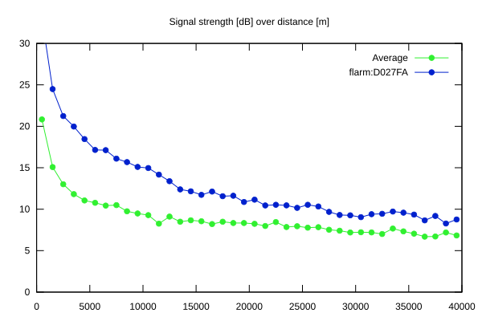
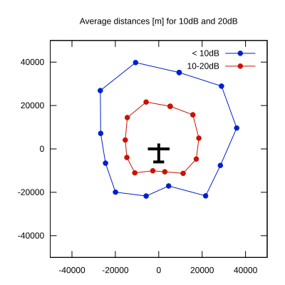

# Ktrax range report — device D027FA

- **Pilot:** Thies Bruins (18_meter, CN IV)
- **Aircraft registration:** D-KIIV
- **live_track_id:** `OGNC30A28:FLRD027FA`
- **Ktrax callsign/ID:** D-KIIV
- **Last measurement:** 2026-07-18T16:00:15Z
- **Versions:** Hardware: 41/Software: 7.43 (received: 2026-07-18T16:02:50Z)
- **Source:** https://ktrax.kisstech.ch/plot?device=D027FA (fetched 2026-07-19T09:14:46Z)

