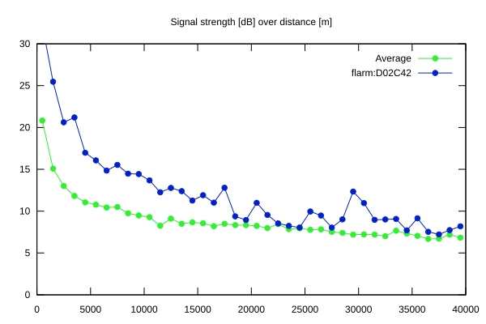
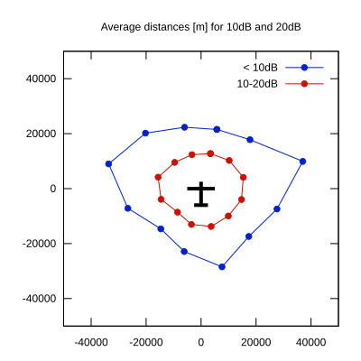

# Ktrax range report — device D02C42

- **Pilot:** Stanislaw Biela (18_meter, CN MR)
- **Aircraft registration:** D-KNMR
- **live_track_id:** `OGNC3080C:FLRD02C42`
- **Ktrax callsign/ID:** D-KNMR
- **Last measurement:** 2026-07-13T15:30:40Z
- **Versions:** Hardware: 41/Software: 7.43 (received: 2026-07-13T15:28:01Z)
- **Source:** https://ktrax.kisstech.ch/plot?device=D02C42 (fetched 2026-07-19T09:14:46Z)

