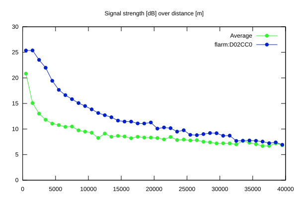
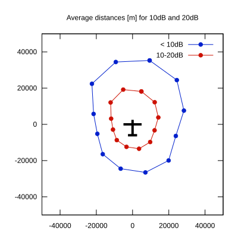

# Ktrax range report — device D02CC0

- **Pilot:** Jan Buch-Madsen (open, CN B)
- **Aircraft registration:** OY-XBM
- **live_track_id:** `OGNC30934:FLRD02CC0`
- **Ktrax callsign/ID:** OYXBM
- **Last measurement:** 2026-07-11T15:38:17Z
- **Versions:** Hardware: 41/Software: 7.43 (received: 2026-07-11T15:37:45Z)
- **Source:** https://ktrax.kisstech.ch/plot?device=D02CC0 (fetched 2026-07-19T09:14:46Z)

