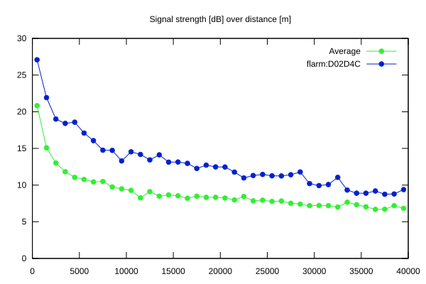
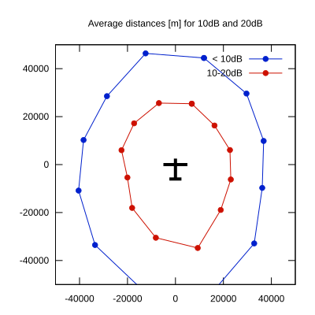

# Ktrax range report — device D02D4C

- **Pilot:** Michael Sommer (open, CN OR)
- **Aircraft registration:** D-KXOR
- **live_track_id:** `OGNC309D0:FLRD02D4C`
- **Ktrax callsign/ID:** -
- **Last measurement:** 2026-07-16T16:22:52Z
- **Versions:** Hardware: 41/Software: 7.40 (received: 2026-07-16T16:18:44Z)
- **Source:** https://ktrax.kisstech.ch/plot?device=D02D4C (fetched 2026-07-19T09:14:46Z)

