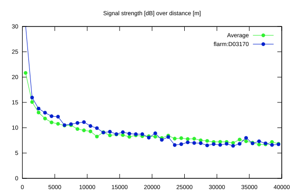
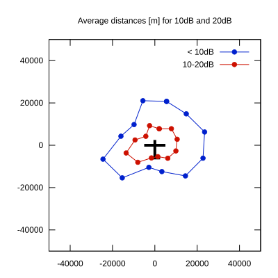

# Ktrax range report — device D03170

- **Pilot:** Petr Krejcirik (18_meter, CN ZE)
- **Aircraft registration:** OK-3773
- **live_track_id:** `OGN6CAC54:FLRD03170`
- **Ktrax callsign/ID:** OK-3773
- **Last measurement:** 2026-07-18T16:05:57Z
- **Versions:** Hardware: 41/Software: 7.43 (received: 2026-07-18T16:05:18Z)
- **Source:** https://ktrax.kisstech.ch/plot?device=D03170 (fetched 2026-07-19T09:14:46Z)

