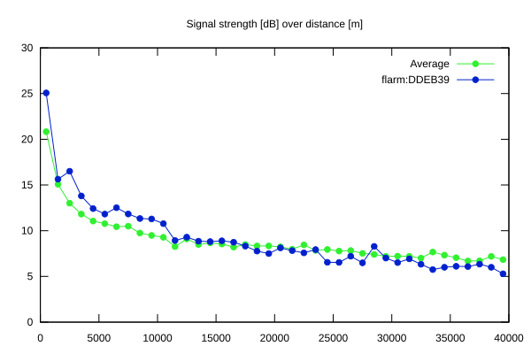
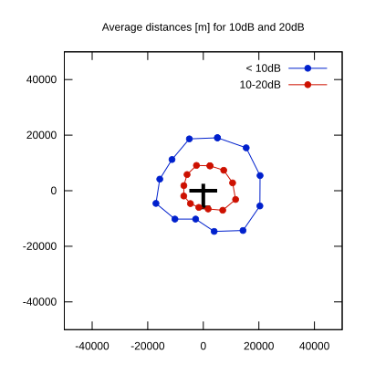

# Ktrax range report — device DDEB39

- **Pilot:** Stefano Cavallari (18_meter, CN C4)
- **Aircraft registration:** D-9794
- **live_track_id:** `OGNC3096C:FLRDDEB39`
- **Ktrax callsign/ID:** -
- **Last measurement:** 2026-07-12T17:29:49Z
- **Versions:** Hardware: 0F/Software: 7.40 (received: 2026-07-12T17:26:29Z)
- **Source:** https://ktrax.kisstech.ch/plot?device=DDEB39 (fetched 2026-07-19T09:14:46Z)

