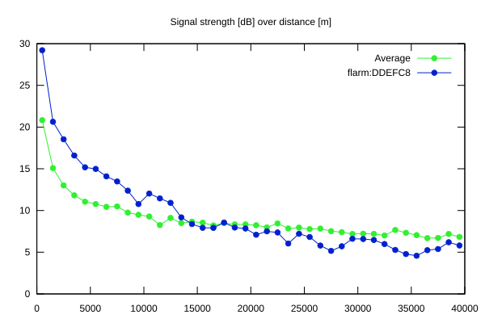
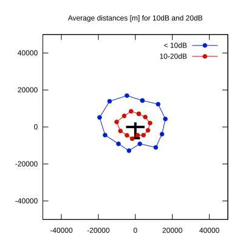

# Ktrax range report — device DDEFC8

- **Pilot:** Teet Jagomägi (18_meter, CN 56)
- **Aircraft registration:** OK-0107
- **live_track_id:** `OGNC30A30:FLRDDEFC8`
- **Ktrax callsign/ID:** OK-0107
- **Last measurement:** 2026-07-18T08:37:35Z
- **Versions:** Hardware: 0F/Software: 7.43 (received: 2026-07-04T14:04:54Z)
- **Source:** https://ktrax.kisstech.ch/plot?device=DDEFC8 (fetched 2026-07-19T09:14:46Z)

