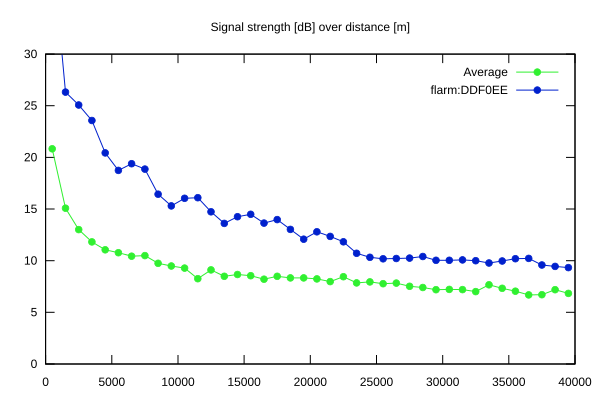
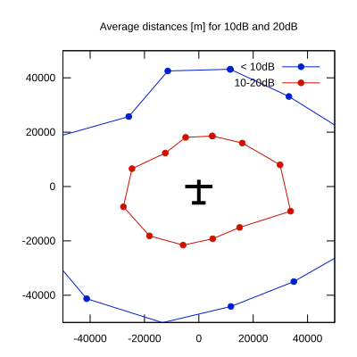

# Ktrax range report — device DDF0EE

- **Pilot:** Takeshi Maruyama (18_meter, CN AX)
- **Aircraft registration:** D-KSTM
- **live_track_id:** `OGNC30A84:FLRDDF0EE`
- **Ktrax callsign/ID:** D-KSTM
- **Last measurement:** 2026-07-10T16:05:03Z
- **Versions:** Hardware: 0F/Software: 7.43 (received: 2026-07-10T16:00:28Z)
- **Source:** https://ktrax.kisstech.ch/plot?device=DDF0EE (fetched 2026-07-19T09:14:46Z)

