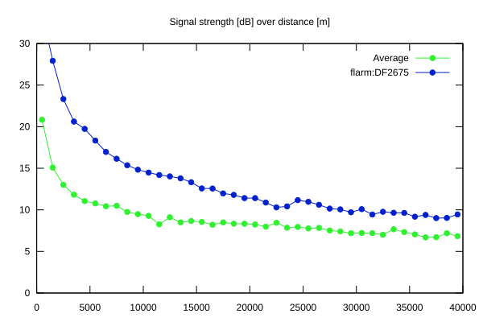
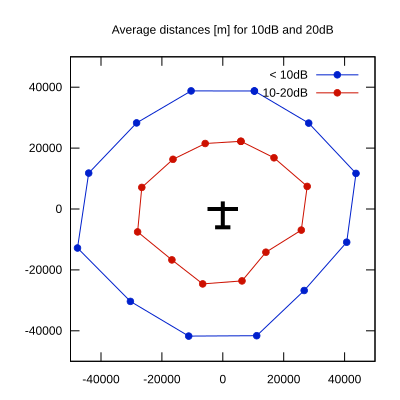

# Ktrax range report — device DF2675

- **Pilot:** Stefan Langer (18_meter, CN SF)
- **Aircraft registration:** D-KFSF
- **live_track_id:** `OGNC3087C:FLRDF2675`
- **Ktrax callsign/ID:** D-KFSF
- **Last measurement:** 2026-07-10T17:11:39Z
- **Versions:** Hardware: 53/Software: 7.40 (received: 2026-07-10T17:10:04Z)
- **Source:** https://ktrax.kisstech.ch/plot?device=DF2675 (fetched 2026-07-19T09:14:46Z)

